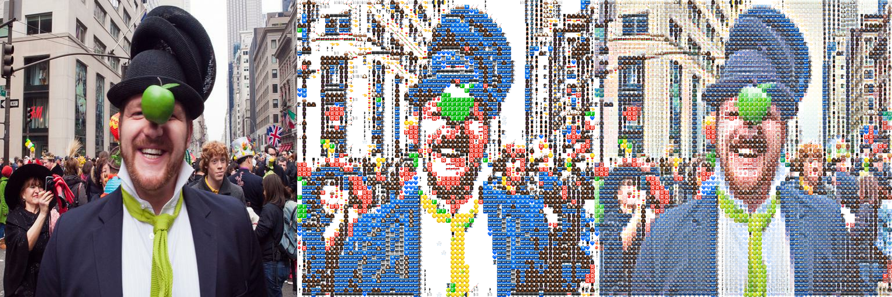
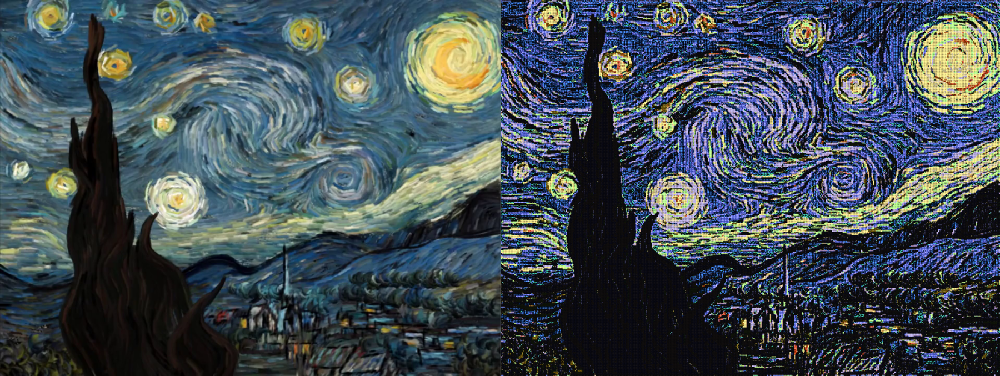

# Perceptual Photomosaic

This is the unofficial source code for [Convolutional Photomosaic Generation via Multi­Scale Perceptual Losses](https://drive.google.com/file/d/1yPn-pY7kJGEWdQvt3AsFPPnQ-Bk1Dk4x/view) presented at the Workshop on Computer Vision for Fashion, Art and Design at ECCV2018. 

## Overview

Photographic mosaics (or simply photomosaics) are images
comprised of smaller, equally-sized image tiles such that when viewed
from a distance, the tiled images of the mosaic collectively resemble a
perceptually plausible image. 

This is a proposed architecture and method for generating photomosaics out of an input image (left in the image below) and a set of smaller templates. The encoder-decoder architecture is followed by a softmax to produce a set of coefficients for each template at non-overlapping patches in the image. This creates a soft output (far right result in image below). By leveraging a scalar temperature variable which increases over time, we encourage the soft output of coefficients to approximate the argmax function as much as possible while remaining differentiable. At test time, we use the argmax function (center result in the image below). VGG16 is used to encode both input and output, and we use a feature reconstruction loss to encourage the features of the output to match the features of the input. 

## Requirements:
Python 3.6
TensorFlow 1.18
SciPy
Numpy

## To run
Run `generate.py`. Default mode is to train, run with `-tr False` if only doing prediction. `-id` specifies an identifier for running the program, and is used for referencing the correct weight files, hyperparameters, etc. `-n` allows notes to be added to runs, which will be saved in `notes/` (will be created if it doesn't exist) in the root directory of the project under the run ID. The file associated with the run in `notes/` will also include information such as iteration count, learning rate, and other hyperparameters. `-logf`, `-printf`, `-chkpt`, `-valf` specify the frequency at which to log information, print it to the screen, save mode checkpoints, and validate, respectively. `-folder [foldername]` specifies the name of the folder containing the templates used for training the model, and the full template path ends up being `perceptual-photomosaic/data/templates/`. `-ls` takes a string which specifies the layers of VGG16 to use for the perceptual loss. `-lsf` takes the factors at which the loss from each layer is weighted. `-dsf` takes the factors at which the layers are scaled to produce the final Gaussian Pyramid. `-bw` is the size of the blurring kernels, `-bf` is the standard deviation to use for each blur.

## Example outputs

